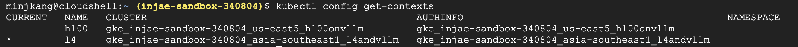

# Inference with vLLM on GKE

> In this lab, you will learn how to deploy open LLMs (Gemma specifically) for serving with GPUs on GKE.

**Use the existing GKE clusters below**
- For `Inference with vLLM on GKE`, use cluster `l4andvllm` in region `asia-southeast1` and cluster `h100onvllm` in region `us-east5`
- For `Inference with JetStream and TPUs on GKE`, use cluster `tpu-cluster-netherlands` in region `europe-west4`

## Prerequisites

This lab assumes you already have two GKE clusters up and running with GPU accelerators (One with L4s attached, the other with H100s attached). If not, you have to create clusters first.

## (Optional) Create kubectl Context

> If you have set up k8s context already, you can skip this part.

To connect to existing GKE clusters, you have to create ~/.kube/config contexts on your local machine. To do so, run the following. You have to replace __${CLUSTER_NAME}__ and __${REGION}__ with the corresponding value for your own environment.

```bash
gcloud container clusters get-credentials ${CLUSTER_NAME} --location=${REGION}
```


You have to run the above command for both GKE clusters, you will see two cluster when running below. It will show you which one is selected as the CURRENT context.

```bash
kubectl config get-contexts
```

If you have set up contexts successfully you will see two rows like below.



To change the CURRENT context, run the following.

```bash
kubectl config use-context ${CONTEXT_NAME_TO_SWITCH}
```

Be sure to remember the above command, as we will deploy the same model on two different clusters.

### Request Gemma Access

Go to [Gemma Model Card](https://huggingface.co/google/gemma-7b-it) to request access (If it's not granted right away, please ask Minjae Kang (minjkang@) or Injae Kwak (ikwak@) for help).

### Create HuggingFace Access Token

Since we will download the model checkpoint from [HuggingFace](https://huggingface.co/), we need to prepare a HuggingFace access token.

At the [Settings](https://huggingface.co/settings/tokens) page, you can generate your access token. Make sure to set __Token type__ as __Read__ when you create the token.

Run the following command after replacing __${YOUR_HF_ACCESS_TOKEN}__ with your own token. Set HuggingFace Access Token as an environment variable as follows:

```bash
export HF_TOKEN=${YOUR_HF_ACCESS_TOKEN}
```

## Deploy Gemma with vLLM

Now it's time to deploy Gemma with vLLM to our clusters. We'll use [gemma-7b-it](https://huggingface.co/google/gemma-7b-it) (Instruction Tuned Gemma 1 7B) for reference.

### Deploy on L4 Cluster

We will start with deploying on the cluster with L4s first. Make sure your L4 cluster is selected as the current context before proceeding.

#### Set HuggingFace Access Token as a k8s Secret

Run the following command to ingest your HuggingFace Access Token to the cluster.

```bash
# Create a unique name for hf-secret eg. yourLdap-secret 
kubectl create secret generic yourLdap-secret \
--from-literal=hf_api_token=$HF_TOKEN \
--dry-run=client -o yaml | kubectl apply -f -
```

#### Create k8s Manifest

Let's create a k8s manifest named __gemma-vllm-l4.yaml__ for *Service* and *Deployment*. Then paste the following to the file.

**Update the name of your secret to the value you set in above step within the manifest eg. yourLdap-secret**
```
secretKeyRef:
  name: yourLdap-secret
  key: hf_api_token
```

```yaml
apiVersion: apps/v1
kind: Deployment
metadata:
  name: vllm-gemma-deployment
spec:
  replicas: 1
  selector:
    matchLabels:
      app: gemma-server
  template:
    metadata:
      labels:
        app: gemma-server
        ai.gke.io/model: gemma-7b-it
        ai.gke.io/inference-server: vllm
        examples.ai.gke.io/source: user-guide
    spec:
      containers:
      - name: inference-server
        image: minjkang/a3-bootcamp-lab3:latest
        resources:
          requests:
            cpu: "2"
            memory: "80Gi"
            ephemeral-storage: "25Gi"
            nvidia.com/gpu: 8
          limits:
            cpu: "2"
            memory: "80Gi"
            ephemeral-storage: "25Gi"
            nvidia.com/gpu: 8
        command: ["python3", "-m", "vllm.entrypoints.api_server"]
        args:
        - --model=$(MODEL_ID)
        - --tensor-parallel-size=2
        - --gpu-memory-utilization=0.7
        env:
        - name: MODEL_ID
          value: google/gemma-7b-it
        - name: HUGGING_FACE_HUB_TOKEN
          valueFrom:
            secretKeyRef:
              name: yourLdap-secret
              key: hf_api_token
        volumeMounts:
        - mountPath: /dev/shm
          name: dshm
      volumes:
      - name: dshm
        emptyDir:
            medium: Memory
      nodeSelector:
        cloud.google.com/gke-accelerator: nvidia-l4
---
apiVersion: v1
kind: Service
metadata:
  name: llm-service
spec:
  selector:
    app: gemma-server
  type: ClusterIP
  ports:
    - protocol: TCP
      port: 8000
      targetPort: 8000
```

#### Apply k8s Manifest to the Cluster

Then, let's deploy it by running the following command.

```bash
kubectl apply -f gemma-vllm-l4.yaml
```

A Pod in the cluster will download the model weights from HuggingFace using your access token and start the serving engine. This will take about 10 minutes.

Wait for the Deployment to be available:

```bash
kubectl wait --for=condition=Available --timeout=700s deployment/vllm-gemma-deployment
```

You can view the logs from the running Deployment:

```bash
kubectl logs -f -l app=gemma-server
```

The Deployment resource downloads the model data. This process can take a few minutes. Once you succeed, the output will be similar to the following:

```bash
INFO:     Started server process [1]
INFO:     Waiting for application startup.
INFO:     Application startup complete.
INFO:     Uvicorn running on http://0.0.0.0:8000 (Press CTRL+C to quit)
```

#### Set Up k8s Port Forwarding for Testing

To send inference requests, let's set up port forwarding by running the following command.

```bash
kubectl port-forward service/llm-service 8000:8000
```

The output is similar to the following:

```bash
Forwarding from 127.0.0.1:8000 -> 8000
```

#### Send Inference Requests

Now we can send inference requests using __../inference.py__. You can replace *user_prompt* with your own one for testing.

```bash
python ../inference.py
```

The following output shows an example of the model response:

```json
{
    "prediction": "prompt:\n<start_of_turn>user\n$I'm new to coding. If you could only recommend one programming language to start with, what would it be and why?<end_of_turn>\noutput:\nSure, here's my recommendation: Python.\n\nPython is a powerful and versatile programming language that is widely used in various industries, including data science, web development...",
    "benchmark": {
        "total_elapsed_time": 14.734968054999968,
        "total_tokens_generated": 371,
        "throughput": 25.178201853930034
    }
}
```

#### Run Benchmark Test

Let's run a benchmark test using __../benchmark.py__. It will send multiple inference requests concurrently and then calculate the average latency and throughput. This may take a while to complete.

```bash
python ../benchmark.py
```

The output will be like:

```text
===== Result =====
Request Counts: 30
Total Elapsed Time for Generation: 316.79 seconds
Total Generated Tokens: 6193
Average Throughput: 19.55 tokens/sec
```

> With that, convert Average Throughput(tokens/sec) into Average Per Cost Performance(tokens/$).

#### Clean up

Let's clean up Gemma on L4 cluster by running the following command.

```bash
kubectl delete -f gemma-vllm-l4.yaml
```

### Deploy on H100 Cluster

Repeat the steps we did for L4 cluster again for H100 cluster.
Make sure your H100 cluster is selected as the current context before proceeding.

```bash
kubectl config use-context ${CONTEXT-NAME-OF-YOUR-H100-CLUSTER}
```

#### Set HuggingFace Access Token as a k8s Secret

Run the following command to ingest your HuggingFace Access Token to the cluster.

```bash
# Create a unique name for hf-secret eg. yourLdap-secret 
kubectl create secret generic yourLdap-secret \
--from-literal=hf_api_token=$HF_TOKEN \
--dry-run=client -o yaml | kubectl apply -f -
```

#### Create k8s Manifest
Let's create a k8s manifest named __gemma-vllm-h100.yaml__ for *Service* and *Deployment*. Then paste the following to the file.

**Update the name of your secret to the value you set in above step within the manifest eg. yourLdap-secret**
```
secretKeyRef:
  name: yourLdap-secret
  key: hf_api_token
```

```yaml
apiVersion: apps/v1
kind: Deployment
metadata:
  name: vllm-gemma-deployment
spec:
  replicas: 1
  selector:
    matchLabels:
      app: gemma-server
  template:
    metadata:
      labels:
        app: gemma-server
        ai.gke.io/model: gemma-7b-it
        ai.gke.io/inference-server: vllm
        examples.ai.gke.io/source: user-guide
    spec:
      containers:
      - name: inference-server
        image: minjkang/a3-bootcamp-lab3:latest
        resources:
          requests:
            cpu: "2"
            memory: "80Gi"
            ephemeral-storage: "25Gi"
            nvidia.com/gpu: 8
          limits:
            cpu: "2"
            memory: "80Gi"
            ephemeral-storage: "25Gi"
            nvidia.com/gpu: 8
        command: ["python3", "-m", "vllm.entrypoints.api_server"]
        args:
        - --model=$(MODEL_ID)
        - --tensor-parallel-size=2
        - --gpu-memory-utilization=0.7
        env:
        - name: MODEL_ID
          value: google/gemma-7b-it
        - name: HUGGING_FACE_HUB_TOKEN
          valueFrom:
            secretKeyRef:
              name: yourLdap-secret
              key: hf_api_token
        volumeMounts:
        - mountPath: /dev/shm
          name: dshm
      volumes:
      - name: dshm
        emptyDir:
            medium: Memory
      nodeSelector:
        cloud.google.com/gke-accelerator: nvidia-h100-80gb
---
apiVersion: v1
kind: Service
metadata:
  name: llm-service
spec:
  selector:
    app: gemma-server
  type: ClusterIP
  ports:
    - protocol: TCP
      port: 8000
      targetPort: 8000
```

#### Apply k8s Manifest to the Cluster

Then, let's deploy it by running the following command.

```bash
kubectl apply -f gemma-vllm-h100.yaml
```

A Pod in the cluster will download the model weights from HuggingFace using your access token and start the serving engine.

Wait for the Deployment to be available:

```bash
kubectl wait --for=condition=Available --timeout=700s deployment/vllm-gemma-deployment
```

You can view the logs from the running Deployment:

```bash
kubectl logs -f -l app=gemma-server
```

The Deployment resource downloads the model data. This process can take a few minutes. Once you succeed, the output will be similar to the following:

```bash
INFO:     Started server process [1]
INFO:     Waiting for application startup.
INFO:     Application startup complete.
INFO:     Uvicorn running on http://0.0.0.0:8000 (Press CTRL+C to quit)
```

#### Set Up k8s Port Forwarding for Testing

To send inference requests, let's set up port forwarding by running the following command.

```bash
kubectl port-forward service/llm-service 8000:8000
```

The output is similar to the following:

```bash
Forwarding from 127.0.0.1:8000 -> 8000
```

#### Send Inference Requests

Now we can send inference requests using __../inference.py__. You can replace *user_prompt* with your own one for testing.

```bash
python ../inference.py
```

The following output shows an example of the model response:

```json
{
    "prediction": "prompt:\n<start_of_turn>user\n$I'm new to coding. If you could only recommend one programming language to start with, what would it be and why?<end_of_turn>\noutput:\n```\nSure, here's my recommendation: Python.\n\nPython is a user-friendly, general-purpose programming language that's widely used in various industries and is considered one of the easiest languages...",
    "benchmark": {
        "total_elapsed_time": 1.7916721450000068,
        "total_tokens_generated": 238,
        "throughput": 132.8368031306303
    }
}
```

#### Run Benchmark Test

Let's run a benchmark test using __../benchmark.py__. It will send multiple inference requests concurrently and then calculate the average latency and throughput.

Set up a venv and install the required python modules
```bash
python3 -m venv vllm
source vllm/bin/activate

pip install aiohttp asyncio
```

```bash
python ../benchmark.py
```

The output will be like:

```text
===== Result =====
Request Counts: 30
Total Elapsed Time for Generation: 65.24 seconds
Total Generated Tokens: 6679
Average Throughput: 102.38 tokens/sec
```

> With that, convert Average Throughput(tokens/sec) into Average Per Cost Performance(tokens/$) and Cost for 1M Tokens Generation($/1M tokens).
<!-- -->
> Compare this with L4 benchmark results. Do they differ significantly?

#### Clean up

Let's clean up Gemma on H100 cluster by running the following command.

```bash
kubectl delete -f gemma-vllm-h100.yaml
```

## Optimize Performance for Gemma with vLLM and GPUs on GKE

Now it's time to get your hands dirty. Your goal is to find an optimal setting (including both infrastructure options and vLLM configurations) for Gemma to achieve minimum Cost for 1kMTokens Generation($/1M tokens).

> Note: Settings provided in this lab is far from the optimal👻.

You can use the existing k8s manifest and benchmarking script for your own experimentation. You can either add or modify vLLM configuration arguments. Share your results through the leaderboard.

> Hint: Refer to k8s manifest and notice how we have passed vLLM settings!
<!-- -->
> Hint: See this [Engine Arguments](https://docs.vllm.ai/en/latest/models/engine_args.html) and [Performance & Tuning](https://docs.vllm.ai/en/latest/models/performance.html) to get information about vLLM setting arguments.

